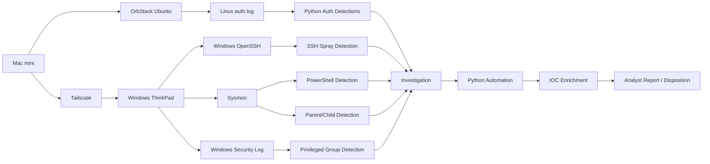
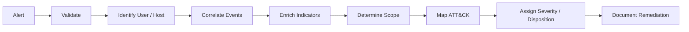

# SOC Detection Engineering Lab

Hands-on blue-team portfolio project demonstrating detection engineering, Windows/Linux telemetry analysis, incident investigation, and SOC automation.

## At a Glance

| Area | What I Built |
| --- | --- |
| Authentication detections | SSH failed-login, failed-then-success, and password-spray analytics |
| Endpoint detections | Suspicious PowerShell, Office parent/child behavior, privileged-group changes |
| Windows telemetry | Sysmon Event IDs 1, 3, 22; Security Event IDs 4624, 4625, 4732 |
| Linux telemetry | Native OpenSSH authentication logs |
| Investigations | Two documented incidents with timelines, scope, disposition, and remediation |
| Automation | Python authentication analyzer with time-window correlation |
| Enrichment | IP/domain classification, DNS resolution, reverse DNS |
| ATT&CK | Technique mappings documented for current detections |

## Architecture



Detailed architecture and workflow: [docs/architecture.md](docs/architecture.md)

## Highlighted Results

### Suspicious PowerShell Investigation
A controlled PowerShell process was correlated across:

```text
Sysmon Event ID 1  -> Process creation
Sysmon Event ID 22 -> github.com DNS lookup
Sysmon Event ID 3  -> TCP/443 connection
```

The same ProcessGuid linked the process, DNS, and network telemetry into one timeline.

[View Incident 001](incidents/incident-001-suspicious-powershell.md)

### Privileged Group Investigation
A synthetic Event ID 4732-style alert was validated against the real endpoint state.

The investigation confirmed:
- the synthetic account was not in the local Administrators group
- no real Event ID 4732 occurred
- surrounding 4624 events were normal SYSTEM service logons

[View Incident 002](incidents/incident-002-privileged-group-change.md)

### Authentication Automation
The Python analyzer identifies both password spraying and failed-logins-followed-by-success.

Validated example:

```text
3 failed attempts
-> 1 successful login
-> same source IP
-> 13 seconds elapsed
-> inside configured 10-minute window
```

It can also enrich observed source IPs during the same run.

[View automation documentation](docs/auth-log-automation.md)

## Detection Coverage

### Authentication
- Repeated failed SSH logins
- Failed authentication followed by success
- Password spraying across multiple usernames
- Native Linux OpenSSH validation
- Native Windows OpenSSH validation

### Endpoint / Process
- Suspicious PowerShell command-line indicators
- Suspicious Office parent/child execution
- Privileged local Administrators group additions

## Core Scripts

| Script | Purpose |
| --- | --- |
| `detect_auth_pattern.py` | Failed-login / success pattern detection |
| `detect_password_spray.py` | Password-spray detection |
| `detect_linux_auth.py` | Native Linux authentication analysis |
| `detect_windows_ssh_spray.ps1` | Windows OpenSSH spray detection |
| `detect_suspicious_powershell.ps1` | Suspicious PowerShell detection |
| `detect_suspicious_parent_child.ps1` | Parent/child process detection |
| `detect_admin_group_addition.ps1` | Privileged-group change detection |
| `collect_sysmon_timeline.ps1` | Sysmon event correlation |
| `analyze_auth_logs.py` | Authentication analysis and time-window correlation |
| `enrich_ioc.py` | Lightweight IOC enrichment |

## Evidence

Start here for validated results:

- [Authentication automation results](docs/evidence/auth-log-automation-results.md)
- [IOC enrichment results](docs/evidence/ioc-enrichment-results.md)
- [Windows OpenSSH password spray test](docs/evidence/windows-openssh-spray-test.md)
- [Suspicious PowerShell test](docs/evidence/suspicious-powershell-test.md)
- [Suspicious parent/child test](docs/evidence/suspicious-parent-child-test.md)
- [Privileged group test](docs/evidence/privileged-group-test.md)

## Skills Demonstrated

Security monitoring • Detection engineering • Sysmon • Windows Event Logs • Linux auth logs • PowerShell • Python • SSH telemetry • Process analysis • DNS/network correlation • MITRE ATT&CK • Incident triage • Timeline analysis • False-positive tuning • IOC enrichment • Git/GitHub

## Investigation Workflow



## Project Documentation

- [Phase 3 Summary](docs/phase-3-summary.md)
- [Phase 4 Summary](docs/phase-4-summary.md)
- [Phase 5 Summary](docs/phase-5-summary.md)
- [Architecture & Workflow](docs/architecture.md)
- [Recruiter Project Summary](docs/portfolio-summary.md)
- [Resume-Ready Project Bullets](docs/resume-project-bullets.md)
- [Roadmap](ROADMAP.md)

## Current Status

- Phase 2 — Authentication Detections: **Complete**
- Phase 3 — Endpoint / Process Detections: **Complete**
- Phase 4 — Incident Investigations: **Complete**
- Phase 5 — Automation and Enrichment: **Complete**
- Phase 6 — Portfolio Polish: **Complete**
- SIEM ingestion: **Planned**

## Author

Edward Johnson  
GitHub: [trustz3ro](https://github.com/trustz3ro)
