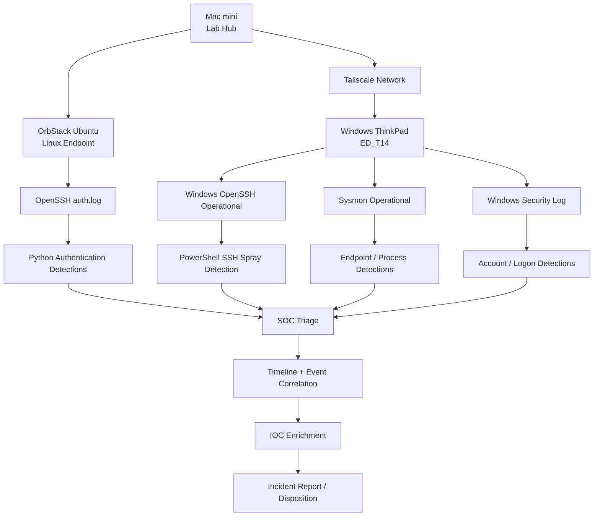

# SOC Lab Architecture and Investigation Workflow

## Environment



## Data Sources

### Linux
- OpenSSH authentication logs
- failed password events
- accepted password events
- username and source-IP context

### Windows
- OpenSSH Operational log
- Windows Security log
- Sysmon Event ID 1 — Process Create
- Sysmon Event ID 3 — Network Connection
- Sysmon Event ID 22 — DNS Query
- Security Event ID 4624 — Successful Logon
- Security Event ID 4625 — Failed Logon
- Security Event ID 4732 — Member Added to Local Security Group

## Detection-to-Investigation Flow

```text
Telemetry
   |
   v
Detection logic
   |
   v
Alert
   |
   v
Validate event source and timestamp
   |
   v
Identify user, host, process, account, source IP
   |
   v
Correlate related events
   |
   v
Enrich indicators
   |
   v
Determine scope and severity
   |
   v
Assign disposition
   |
   v
Document remediation and lessons learned
```

## Current Lab Strength

The lab demonstrates the full path from raw endpoint or authentication telemetry through detection, validation, event correlation, enrichment, and final incident disposition.

A future SIEM phase will centralize these telemetry sources and detections into a common platform.
